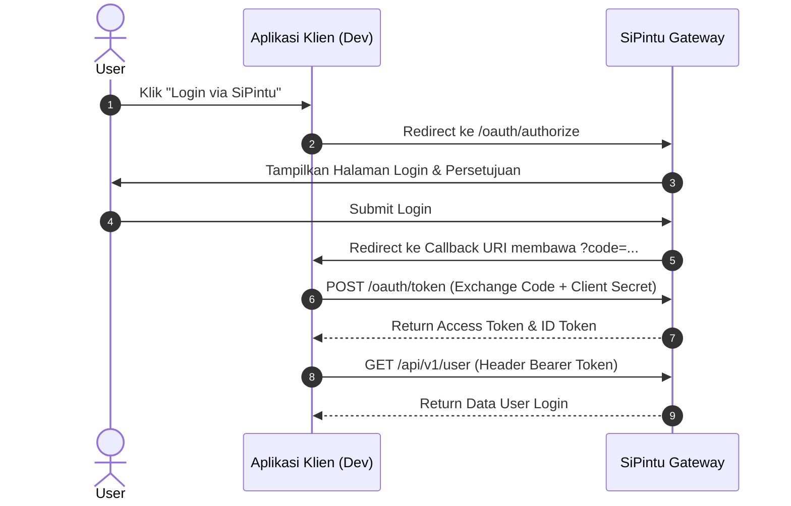

# Panduan Integrasi API & OAuth 2.0 SiPintu Gateway

Dokumen ini berisi panduan teknis bagi pengembang (developer) yang ingin mengintegrasikan aplikasi eksternal (client app) dengan **SiPintu Identity & API Gateway**.

---

## 📌 Ringkasan Konsep

Aplikasi klien **TIDAK HARUS di-deploy** untuk dapat mengakses API SiPintu. Pengembangan dapat dilakukan sepenuhnya di lingkungan **Development / Localhost**.

SiPintu mendukung **2 Metode Integrasi**:
1. **Server-to-Server Gateway (Header Auth)**: Untuk mengambil data langsung antar backend (misal: Data Siswa SIJUNA) tanpa alur login browser pengguna.
2. **OAuth 2.0 / OpenID Connect SSO (User Auth)**: Untuk fitur *"Login dengan SiPintu"* di aplikasi klien.

---

---

## 🗝️ Langkah 1: Registrasi Aplikasi Client (Cara Tercepat via CLI)

Anda dapat mendaftarkan aplikasi klien dan mendapatkan kredensial SSO secara instan menggunakan perintah Artisan di folder `SiPintu`:

```bash
# 1. Daftarkan aplikasi klien baru
php artisan sipintu:sso-client "TESApi App" --redirect=http://localhost:8001/oauth/callback --base-url=http://localhost:8001

# 2. Lihat daftar aplikasi terdaftar
php artisan sipintu:sso-list

# 3. Uji kesehatan sistem OAuth Gateway
php artisan sipintu:sso-health
```

| Parameter | Deskripsi | Contoh (Development) |
| :--- | :--- | :--- |
| **Client ID** | ID Unik Aplikasi Anda | `app_mecmvhpduc8e` |
| **Client Secret** | Kunci Rahasia Aplikasi | `sec_uEr8wGucp1jda8Ls6qOBsW03HrYVj6UK` |
| **Redirect URI** | URL Callback SSO Aplikasi Anda | `http://localhost:8001/oauth/callback` |

> 📌 **Dokumentasi Detail Kode:** Lihat file [SIPINTU_SSO_GUIDE.md](SIPINTU_SSO_GUIDE.md) untuk panduan lengkap controller & route copy-paste.

---

## 🚀 METODE 1: Server-to-Server Gateway (Data API Direct Access)

Gunakan metode ini jika aplikasi Anda hanya membutuhkan akses data backend (seperti Query Data Siswa SIJUNA) tanpa keterlibatan login browser pengguna.

### Autentikasi Header
Setiap request HTTP wajib menyertakan header berikut:
* `X-Client-ID`: `<CLIENT_ID_ANDA>`
* `X-Client-Secret`: `<CLIENT_SECRET_ANDA>`
* `Accept`: `application/json`

### Endpoint Tersedia

#### 1. List Data Siswa SIJUNA
* **Endpoint:** `GET /api/v1/sijuna/students`
* **Query Parameters (Opsional):**
  * `nis` (string) — Filter berdasarkan NIS siswa (misal: `?nis=1234567890`)
  * `search` (string) — Pencarian berdasarkan nama

#### Contoh Implementasi JavaScript (Node.js / Browser Fetch):
```javascript
const SIPINTU_BASE_URL = process.env.SIPINTU_API_URL || 'http://localhost:8000';

async function fetchStudents(nis = null) {
  const url = new URL(`${SIPINTU_BASE_URL}/api/v1/sijuna/students`);
  if (nis) url.searchParams.append('nis', nis);

  try {
    const response = await fetch(url, {
      method: 'GET',
      headers: {
        'Accept': 'application/json',
        'X-Client-ID': 'app_sijuna_dev',
        'X-Client-Secret': 'sec_xyz1234567890'
      }
    });

    if (!response.ok) {
      throw new Error(`HTTP Error! Status: ${response.status}`);
    }

    const result = await response.json();
    console.log('Data Siswa:', result);
    return result;
  } catch (error) {
    console.error('Gagal mengambil data siswa:', error);
  }
}
```

#### Contoh Implementasi PHP (Laravel / Guzzle HTTP):
```php
use Illuminate\Support\Facades\Http;

$response = Http::withHeaders([
    'X-Client-ID'     => 'app_sijuna_dev',
    'X-Client-Secret' => 'sec_xyz1234567890',
    'Accept'          => 'application/json',
])->get('http://localhost:8000/api/v1/sijuna/students', [
    'nis' => '1234567890',
]);

if ($response->successful()) {
    $siswa = $response->json();
}
```

---

## 🔐 METODE 2: OAuth 2.0 / OpenID Connect SSO ("Login via SiPintu")

Gunakan metode ini jika aplikasi Anda menginginkan autentikasi terpusat (Single Sign-On).

### Alur Kerja SSO (4 Langkah)



#### 1. Redirect User ke Authorization Endpoint
Arahkan pengguna dari browser ke:
```text
GET http://localhost:8000/oauth/authorize?client_id=app_sijuna_dev&redirect_uri=http://localhost:3000/callback&response_type=code&state=xyz123
```

#### 2. Tangkap Authorization Code di Callback URL
Setelah pengguna menyetujui login, SiPintu akan mengembalikan pengguna ke callback URI Anda:
```text
http://localhost:3000/callback?code=AUTH_CODE_TEMPORARY&state=xyz123
```

#### 3. Tukar Code dengan Access Token (Backend Request)
Kirimkan POST request dari backend Anda ke `/oauth/token`:
```http
POST /oauth/token HTTP/1.1
Host: localhost:8000
Content-Type: application/x-www-form-urlencoded

grant_type=authorization_code
&client_id=app_sijuna_dev
&client_secret=sec_xyz1234567890
&code=AUTH_CODE_TEMPORARY
&redirect_uri=http://localhost:3000/callback
```

**Response Success (JSON):**
```json
{
  "access_token": "80_character_random_bearer_token_string",
  "token_type": "Bearer",
  "expires_in": 86400,
  "refresh_token": "80_character_refresh_token_string",
  "id_token": "eyJhbGciOiJIUzI1Ni... (OpenID JWT Token)"
}
```

#### 4. Akses Endpoint Profile User
Gunakan `access_token` pada header `Authorization: Bearer <token>`:
```javascript
const response = await fetch('http://localhost:8000/api/v1/user', {
  headers: {
    'Authorization': `Bearer ${accessToken}`,
    'Accept': 'application/json'
  }
});

const userProfile = await response.json();
```

---

## 🧪 Testing via cURL & Postman

### Test Server-to-Server API (cURL)
```bash
curl -X GET "http://localhost:8000/api/v1/sijuna/students?nis=1234567890" \
     -H "Accept: application/json" \
     -H "X-Client-ID: app_sijuna_dev" \
     -H "X-Client-Secret: sec_xyz1234567890"
```

### Setup di Postman
1. **Method:** `GET`
2. **URL:** `http://localhost:8000/api/v1/sijuna/students`
3. **Headers:**
   * Key: `Accept`, Value: `application/json`
   * Key: `X-Client-ID`, Value: `<CLIENT_ID_ANDA>`
   * Key: `X-Client-Secret`, Value: `<CLIENT_SECRET_ANDA>`

---

## 🛠️ Tips & Troubleshooting

1. **CORS Error di Browser:**
   Jika aplikasi frontend `localhost:3000` mendapat galat CORS, pastikan origin `http://localhost:3000` sudah didaftarkan pada konfigurasi SiPintu (`config/cors.php`).
2. **Simpan Base URL di Environment File (`.env`):**
   Selalu simpan URL SiPintu di file `.env` aplikasi klien Anda (misal `SIPINTU_API_URL=http://localhost:8000`), agar saat aplikasi siap di-deploy ke production Anda hanya perlu mengubah variabel `.env` tanpa menyentuh kode program.